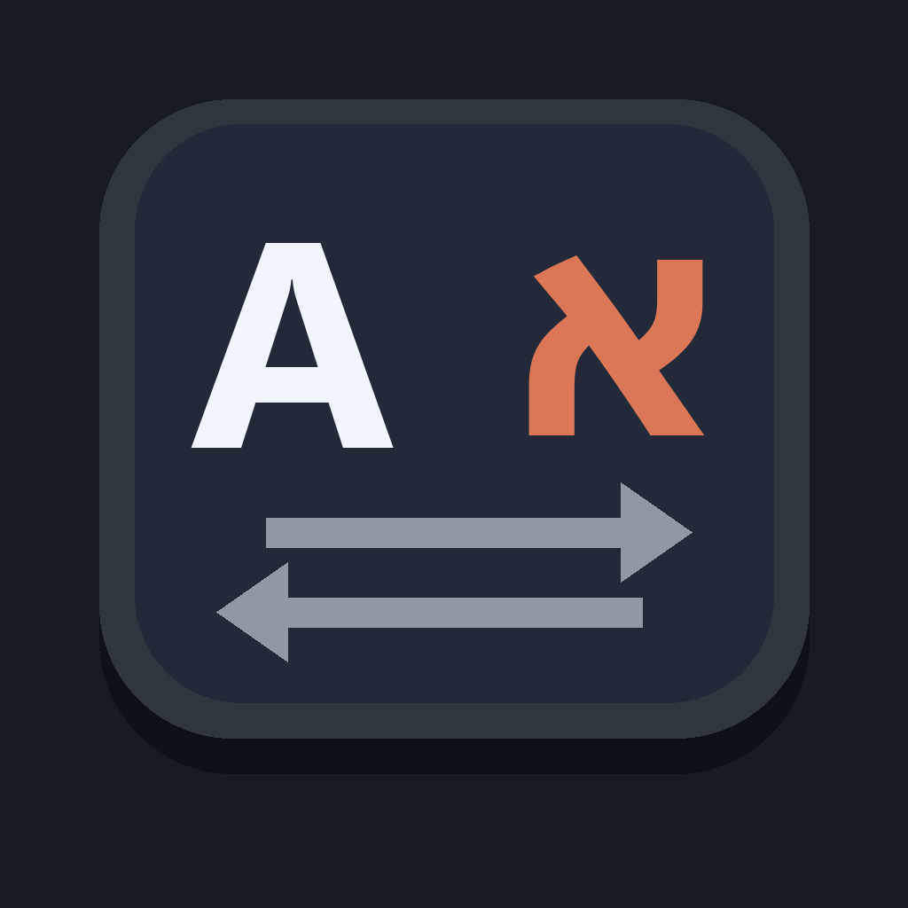
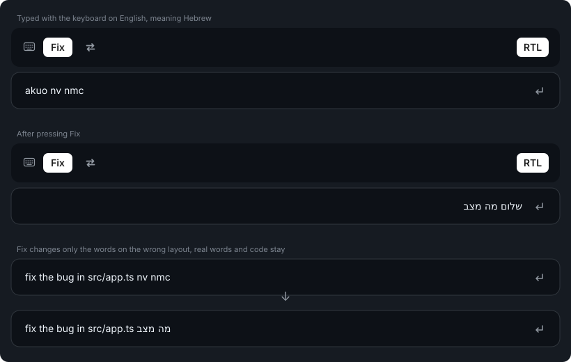
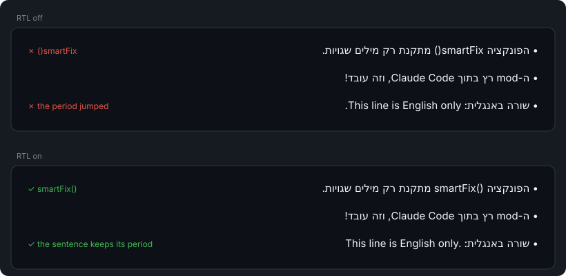

<h1> altshift</h1>

A Claude Code plugin for working in Hebrew and English. A slim band above the prompt fixes text you typed with the keyboard on the wrong language, and shows Hebrew in the chat right-to-left.

Named after **Alt+Shift**, the shortcut you forgot to press when `akuo` came out instead of `שלום`.

- **Fix**: converts only the words typed on the wrong layout. Real words, names and code stay as they are.
- **Swap** (⇄): converts the whole prompt to the other layout, no guessing.
- **RTL**: shows Hebrew lines in the chat right-to-left, so brackets, periods, inline code and English words inside a Hebrew sentence stay in place.

**Works in the Claude desktop app** (the Code tab) **and in the Claude Code terminal.** In the desktop app the band has native buttons and an icon; in the terminal it uses text buttons.



## Features

### Fix

Press **Fix** and the plugin goes over the prompt word by word. A word that only makes sense on the other layout is converted; everything else is left alone:

- English words, names and acronyms (`fix`, `the`, `API`) stay.
- Code stays: paths, numbers, `camelCase`, `snake_case`, anything with `@`, `:` or `=`.
- Hebrew words stay, and a Hebrew word typed on the English layout (`nv nmc`) becomes Hebrew (`מה מצב`).
- English typed on the Hebrew layout (`יקךךם`) becomes English (`hello`).

Some mistyped words happen to be real words too: `אם` typed on the English layout is `to`, and `גם` is `do`. Those follow the words around them, so `nv to tbh` becomes `מה אם אני` while `i want to go` stays English.

If Fix finds nothing to change, a short notice says so. If it gets a word wrong, **Swap** converts everything with no guessing.

### Swap

Converts the whole prompt to the other layout: mostly Hebrew letters become English, otherwise English becomes Hebrew.

### RTL

The chat lays out each line by its first letter, so a Hebrew line with English inside it often comes out scrambled: `smartFix()` shows as `()smartFix`, and the period of an English sentence jumps to its start. With **RTL** on, the plugin marks each Hebrew line right-to-left and keeps inline code, code-like terms (`this()`, `file.ts`) and English sentences in their own left-to-right order.



RTL applies to Claude's replies and to your own messages. Code blocks, tables and English lines are never touched. It only changes how the chat is drawn: the conversation itself, and what Claude reads, stay exactly as written. The choice is remembered across sessions.

## Usage

| Button | What it does |
|---|---|
| **Fix** | Converts only the words typed on the wrong layout |
| **⇄** | Converts the whole prompt to the other layout |
| **RTL** | Turns right-to-left Hebrew in the chat on (filled) or off (dim) |

## What the plugin does on your computer

Everything altshift does is listed here. It makes no network requests, starts no programs, and never sends your prompts, messages or anything else anywhere.

**Your prompt.** Only when you press **Fix** or **⇄**: the plugin reads the text in the prompt box, converts it, and puts the result back. It never reads the prompt otherwise, and never sends it.

**Files.** It writes no files of its own. The RTL choice (on or off) is kept in Claude Code's own storage for plugins, on your computer.

**Hooks.**
- `session.start`: reads back the RTL choice.
- `ui.render`: draws the band above the prompt (`AbovePrompt`). With RTL on, it also adds invisible direction marks to the drawn text of chat messages that contain Hebrew (`UserMessage`, `AssistantMessage`). The stored conversation is not changed. Every other drawing passes through unchanged.

## Limitations

- **Your own messages stay left-aligned.** The desktop app draws your message bubble left-to-right, and a plugin can't change its alignment. RTL still fixes the order of the words in each line.
- **Fix guesses.** It decides from rules and a list of common words, not a dictionary, so a rare word can be missed or flipped. **⇄** is there for those times.
- **Hebrew only, for now.** Fix and Swap know the standard Israeli (SI-1452) layout.

## Requirements

- **Claude Code 2.1.288 or newer.** Earlier versions don't support plugin hook modules and the events this band uses. Check with `claude --version`. The Claude desktop app keeps its own copy up to date.

## Installation

The plugin is installed once, with the `claude` command line. Both the terminal and the Claude desktop app read the same installed plugins, so one install covers both.

### 1. Open a terminal

- **Windows:** PowerShell or Windows Terminal.
- **macOS / Linux:** any terminal.

Check that Claude Code is installed and new enough (2.1.288 or newer):

```bash
claude --version
```

If `claude` is not found, install Claude Code first: <https://docs.claude.com/en/docs/claude-code/setup>.

### 2. Add the marketplace

This tells Claude Code where to find the plugin (this GitHub repo):

```bash
claude plugin marketplace add YossiAbutbul/altshift
```

### 3. Install the plugin

```bash
claude plugin install altshift@altshift
```

Installing also enables it. There is nothing else to switch on.

### 4. Start a new session

Plugins load when a session starts, so sessions that were already open won't have it.

- **Terminal:** run `claude`.
- **Desktop app:** start a new session in the Code tab.

### 5. Check that it works

The band appears above the prompt. Type `akuo` and press **Fix**: it becomes `שלום`.

## Updating

```bash
claude plugin marketplace update altshift
claude plugin update altshift@altshift
```

Then start a new session.

## Uninstalling

```bash
claude plugin uninstall altshift@altshift
claude plugin marketplace remove altshift
```

## Troubleshooting

| Problem | Fix |
|---|---|
| The band doesn't appear | Start a **new** session after installing. Check `claude --version` is 2.1.288 or newer and that `claude plugin list` shows `altshift@altshift` as enabled. |
| The band appears twice | The plugin is loaded twice, for example installed **and** also loaded with `--plugin-dir` or listed in `CLAUDE_CODE_PLUGIN_DIRS`. Keep only one. |
| "Could not write the prompt box" | A dialog was open over the prompt. Close it and press the button again. |
| A message I already saw didn't change after turning RTL on | RTL applies as messages are drawn. Scroll it out of view and back, or look at the next message. |
| Errors | Run `claude --debug`; lines starting with `altshift:` explain what failed. |

### Try it once without installing

To load it for a single terminal session only:

```bash
git clone https://github.com/YossiAbutbul/altshift.git
claude --plugin-dir ./altshift
```

## Development

The tests load the real plugin and draw the band and chat messages through Claude Code's own test kit. Run them with Claude Code 2.1.288 or newer:

```bash
claude plugin test .
```

## Versions

See [CHANGELOG.md](CHANGELOG.md) for what changed in each version, and the [releases](https://github.com/YossiAbutbul/altshift/releases) for every released version. Each version is a git tag (`v1.0.0`), and pushing a tag publishes its GitHub Release from the changelog.

## License

MIT © 2026 Yossi Abutbul. See [LICENSE](LICENSE).
